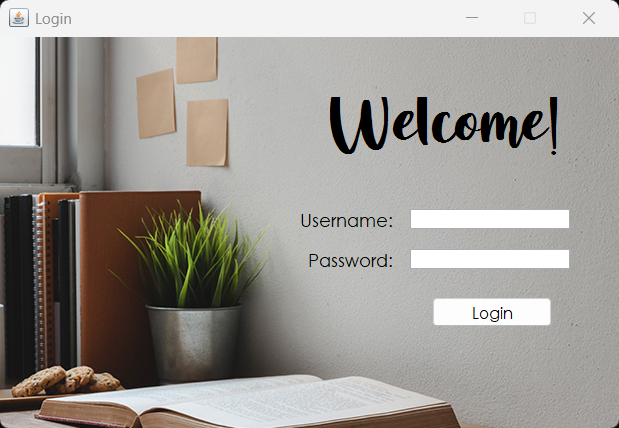
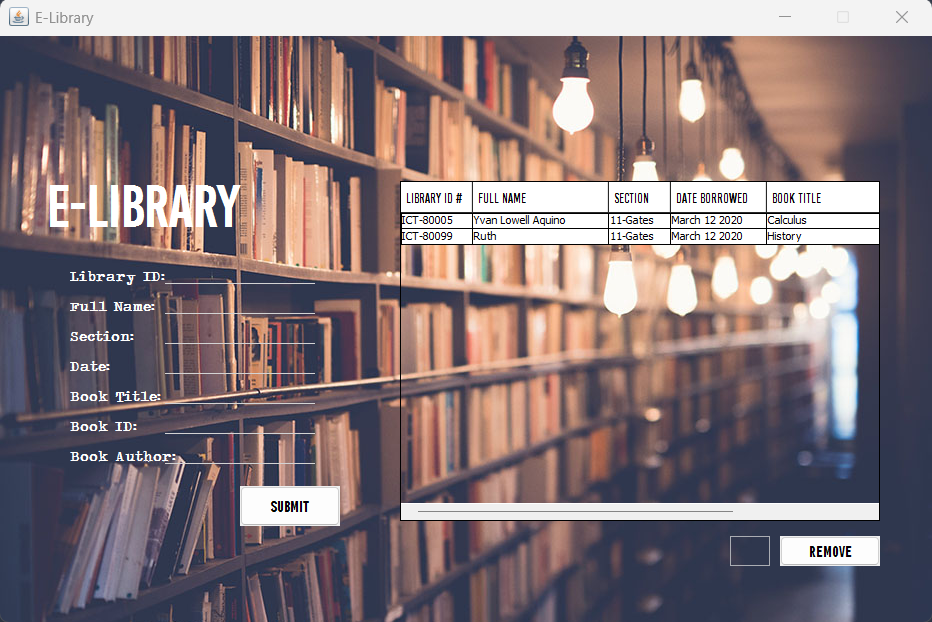

# E-Library
  

An E-Library used for tracking books, with the target of being used in libraries.

### Author's Notes

A project for the Computer Hardware Servicing (CHS) subject as a grade 11 student. This was a paired project but I coded this alone. I made this from March 10 to 12 of 2020 and is my first project in Java.

## Screenshots

    <h3>Login Form</h3>
    
    <h3>Main Form</h3>
    

## How to Run

You need to download JDK8 in the [Oracle](http://oracle.com/) website. As of time of writing, the latest version is JDK24, but do note that running the project using later versions might cause issues/errors. Then, run the following commands: `javac E_Library.java` then `java E_Library`.

## Feedback

If you have any feedback/comment/request, please reach out to [aquino.ylt@gmail.com](mailto:aquino.ylt@gmail.com).

### Thank you and God bless!
